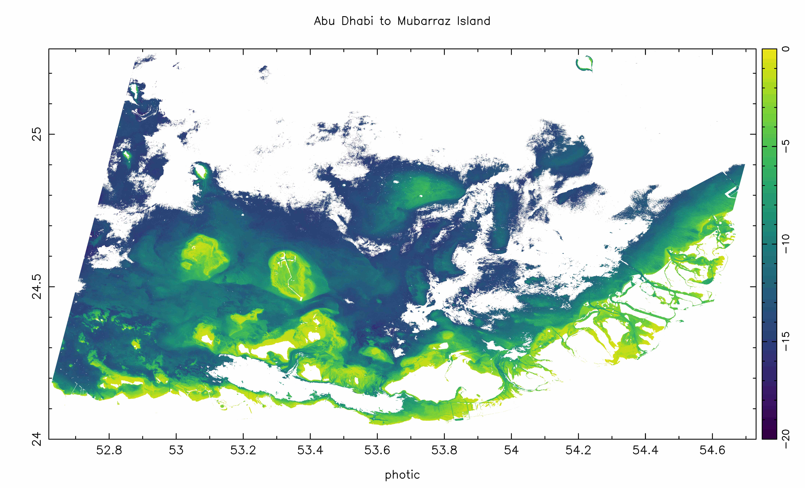

# _photic_ - A Physics-Based, Satellite-Derived Bathymetry Model

## About

_photic_ is a C implementation of the physics-based, satellite-derived bathymetry model as described in (Blake, 2020). 

## Model

## Features 

## Installation & Dependencies 

### NetCDF
NetCDF developer libraries can be installed via brew with `brew install netcdf`. 

### PGPLOT
PGPLOT can be installed (on a mac) via macports with `port install pgplot`, or compiled from source, which can be downloaded from

https://sites.astro.caltech.edu/~tjp/pgplot/

### Giza
Alternatively, Giza can be used as a drop-in replacement for the ageing PGPLOT library:

https://github.com/danieljprice/giza

### Linenoise
_photic_ uses the _linenoise_ library for the repl:

https://github.com/antirez/linenoise

### XQuartz (OSX)
For interactive graphics (on a mac) we need to install XQuartz:

https://www.xquartz.org/

### GDAL
Converting from LANDSAT and Sentinel-2 imagery into a _photic_-readable gridded file requires gdal (https://gdal.org/), which can be installed via brew with `brew install gdal`. 

### ACOLITE
All experiments with _photic_ have used the excellent atmospheric correction software, ACOLITE (https://odnature.naturalsciences.be/remsem/software-and-data/acolite): 

https://github.com/acolite/acolite

## Open Data from _photic_

DISCLAIMER! This should be obvious, but these data from _photic_ should not be used for navigation or for any other purpose relating to safety at sea or where commercial losses could occur.

### Western Australia - Exmouth to Whim Creek 

### Western Australia - Exmouth Gulf

### Western Australia - Murion Island

### UAE - Abu Dhabi to Dubai

### UAE - Mubarraz Island to Abu Dhabi 

This study comprised $11408$ $\text{km}^2$ of optically shallow water. 

### Qatar - Eastern Qatar to Sir Baniyas Island

### Qatar, Bahrain and Saudi Arabia

## References

(Blake, 2020) https://arxiv.org/abs/2002.02298
